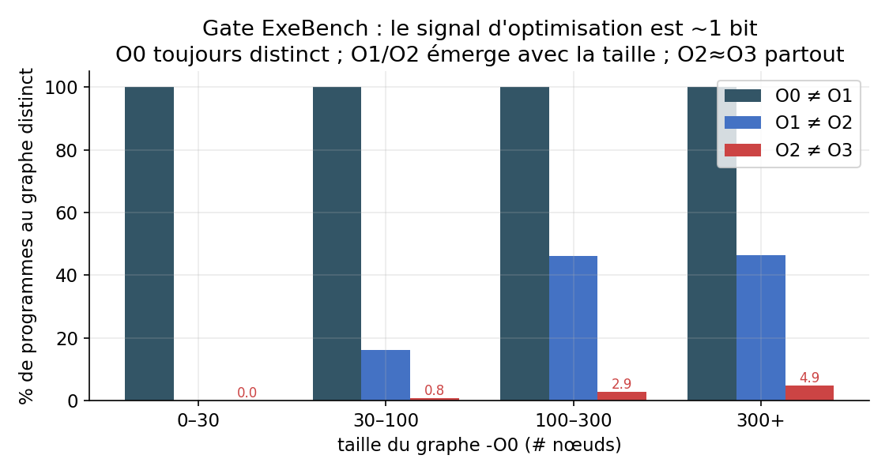
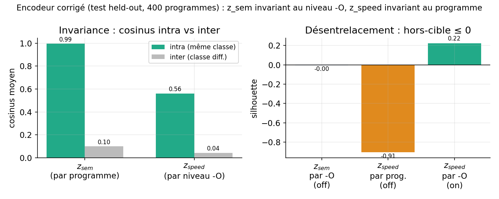
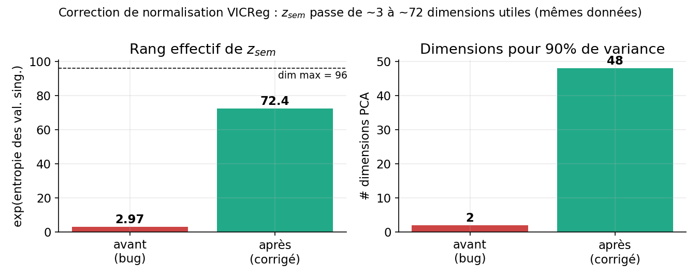

# Un encodeur factorisé auto-supervisé (VICReg conditionnel) pour graphes d'IR LLVM

*Note technique — v2, 2026-07-01. Destinée à un chercheur, pour discussion et critique.*
*Périmètre : l'**encodeur** uniquement (pas de décodeur, pas d'optimiseur, pas de produit).*

> **Positionnement honnête (lire d'abord).** Le projet interne s'appelle « JEPA-ASM » —
> **c'est un abus de langage**. La méthode ici **n'est pas du JEPA** : il n'y a ni
> prédicteur latent, ni masquage, ni encodeur-cible EMA. C'est un objectif de la famille
> **VICReg / Barlow-Twins / Siamese** (invariance + variance + covariance), appliqué de
> façon **conditionnelle à deux groupages supervisés** (identité de programme, niveau
> `-O`). Les inputs sont de l'**IR LLVM** (pas de l'assembleur brut). Cette note est une
> **note d'application + de diagnostic**, pas une contribution méthodologique nouvelle. Les
> résultats intrinsèques ci-dessous ne sont **pas encore étalonnés contre des baselines**
> (voir §7) — le pod d'entraînement étant indisponible au moment de la rédaction.

## Résumé

On apprend, **sans labels manuels** (mais avec deux groupages supervisés qui définissent
les positifs), un encodeur de programmes $f_\theta$ sur des graphes **ProGraML** (Cummins
et al., arXiv 2003.10536 ; paquet pip `programl`), représentation GNN-sur-IR-LLVM.
L'embedding de sortie est **factorisé** en deux sous-espaces, $z = [z_{sem} \,\|\, z_{speed}]$,
entraînés pour que :
- $z_{sem}$ soit **invariant au niveau d'optimisation** `-O` (sous-espace « invariant à -O »),
- $z_{speed}$ soit **invariant au programme** (sous-espace « invariant au programme »).

*(Les étiquettes « sem » / « speed » sont des raccourcis aspirationnels — voir §6.)*

Deux résultats **honnêtes** méritent discussion : (i) un **gate** pré-entraînement montre
que le signal d'optimisation apprenable sur des fonctions isolées est **~1 bit** (O2≈O3
pour 98.4 % des fonctions, Fig. 2) ; (ii) un **bug de normalisation VICReg** effondrait la
représentation à ~3 dimensions ; corrigé, le rang effectif de $z_{sem}$ passe à **~72/96** à
données constantes (Fig. 1). Ces résultats sont un run unique ($n{=}1$) et **sans baseline**
— à considérer comme des observations à consolider, pas des mesures établies.

---

## 1. Formalisation

**Graphe programme.** Un programme compilé produit un graphe orienté typé
$G = (V, E, \phi)$ avec nœuds $V$, arêtes typées
$E \subseteq V \times V \times R$, $R = \{\text{control}, \text{data}, \text{call}\}$
(les flux ProGraML), et étiquette de nœud $\phi: V \to \Sigma$ (opcode/texte). La feature
de nœud est l'identifiant de vocabulaire $\mathrm{id}(\phi(v)) \in \{0,\dots,K\}$
(0 = `<unk>`). On note $E_r = \{(u,v) : (u,v,r)\in E\}$.

**Vues.** Chaque programme $P$ est compilé aux niveaux
$\ell \in \mathcal{O} = \{\texttt{-O0},\texttt{-O1},\texttt{-O2},\texttt{-O3}\}$ (clang-10
embarqué par ProGraML), donnant 4 graphes $G_P^\ell$. Le niveau `-O` ne sert **qu'à
grouper** les vues (positifs) — c'est une **supervision faible**, pas une cible de
classification.

**Encodeur.** $f_\theta : \mathcal{G} \to \mathbb{R}^{d}$, $d = d_{sem}+d_{speed}$,
$f_\theta(G) = [\,z_{sem} \,\|\, z_{speed}\,]$.

## 2. Modèle ($\texttt{FactoredEncoder}$)

Tronc GNN à $L$ couches, **une convolution par relation** (schéma R-GCN / ProGraML) :
$$
h^{(0)}_v = W_{\text{in}}\,\mathrm{emb}(\mathrm{id}(\phi(v))) + \mathrm{PE}(v),
\qquad
h^{(l+1)} = \mathrm{LN}\!\Big(h^{(l)} + \mathrm{Drop}\big(\sigma\big(\textstyle\sum_{r\in R}\mathrm{GraphConv}_r(h^{(l)}, E_r)\big)\big)\Big),
$$
où $\mathrm{PE}(v)$ encode le log-degré entrant/sortant par relation. Lecture (pooling)
concaténant moyenne et max : $p = [\,\mathrm{mean}_v\, h^{(L)}_v \;\|\; \max_v\, h^{(L)}_v\,] \in \mathbb{R}^{2H}$.
Deux têtes MLP (avec BatchNorm) projettent :
$z_{sem} = g_{sem}(p) \in \mathbb{R}^{d_{sem}}$, $z_{speed} = g_{speed}(p) \in \mathbb{R}^{d_{speed}}$.
Config : $H{=}256$, $L{=}6$, $d_{sem}{=}96$, $d_{speed}{=}32$, $K{=}8192$, entraîné **de zéro**.

## 3. Objectif d'apprentissage (VICReg conditionnel factorisé)

Batch de $B$ programmes $\times$ 4 vues, soit $N = 4B$ embeddings, chaque ligne $i$
étiquetée par son programme $\mathrm{prog}(i)$ et sa classe de vitesse
$\mathrm{spd}(i) = \pi(\ell_i)$ ($\pi$ = regroupement de niveaux, identité par défaut).

**Invariance de groupe** (invariance VICReg conditionnée par une classe, moyennée sur
lignes **et** dimensions) :
$$
\mathcal{I}(Z, c) \;=\; \frac{1}{N\,d}\sum_{i=1}^{N} \big\lVert z_i - \mu_{c(i)} \big\rVert_2^2,
\qquad \mu_k = \frac{1}{|c^{-1}(k)|}\sum_{i:\,c(i)=k} z_i .
$$

**Termes anti-effondrement VICReg** par bloc (Bardes, Ponce & LeCun, 2022) :
$$
\mathcal{V}(Z) = \frac{1}{d}\sum_{j} \max\!\big(0,\,1-\sqrt{\mathrm{Var}(Z_{:,j})+\epsilon}\big),
\qquad
\mathcal{C}(Z) = \frac{1}{d}\sum_{j\neq k} \mathrm{Cov}(Z)_{jk}^2 .
$$

**Décorrélation croisée** (terme type Barlow-Twins, Zbontar et al. 2021, appliqué entre
blocs) :
$$
\mathcal{X}(z_{sem},z_{speed}) = \frac{1}{\max(d_{sem},d_{speed})}\sum_{j,k}\mathrm{Cov}(z_{sem},z_{speed})_{jk}^2 .
$$

**Perte totale** ($= \alpha\mathcal{I}+\beta\mathcal{V}+\gamma\mathcal{C}$ par bloc) :
$$
\mathcal{L} = \lambda_{sem}\big[\alpha\,\mathcal{I}(z_{sem},\mathrm{prog}) + \beta\,\mathcal{V}(z_{sem}) + \gamma\,\mathcal{C}(z_{sem})\big]
+ \lambda_{spd}\big[\alpha\,\mathcal{I}(z_{speed},\mathrm{spd}) + \beta\,\mathcal{V}(z_{speed}) + \gamma\,\mathcal{C}(z_{speed})\big]
+ \lambda_{x}\,\mathcal{X}.
$$
avec $(\alpha,\beta,\gamma)=(25,25,1)$ (valeurs canoniques VICReg) et
$\lambda_{sem}=\lambda_{spd}=\lambda_x=1$. **Aucun composant n'est nouveau** : c'est VICReg
+ un terme croisé Barlow-Twins sur une architecture R-GCN/ProGraML.

**Données & optim.** Corpus **ExeBench** (`train_real_compilable`), ~8000 fonctions C
compilées O0–O3. Vocab des `text` (top-$K$). Split anti-fuite déterministe par hash. Adam,
lr $10^{-3}$ (cosine + warmup), 50 époques, $B=128$ programmes/batch, un GPU (A100/B200).
Éval sur pool held-out disjoint. **Run unique, une seule graine.**

## 4. Résultats (observations, non étalonnées)

### 4.1 Gate : combien de bits d'optimisation sont apprenables ?

Avant d'entraîner, on mesure si le graphe **change** entre niveaux `-O` (sinon $z_{speed}$
est impossible). Sur 555 fonctions, signature de graphe canonique par (programme, niveau) :

| paire | % graphes distincts |
|---|---|
| **O0 ≠ O1** | **100 %** |
| O1 ≠ O2 | 24.9 % |
| **O2 ≠ O3** | **1.6 %** |

**Lecture (Fig. 2).** O0 est toujours distinct ; O1/O2 n'émerge que sur les fonctions
$\gtrsim 100$ nœuds ; **O2≈O3 partout** (clang sature sur des fonctions isolées : rien à
inliner, boucles trop courtes pour vectoriser). Le signal d'optimisation apprenable ici est
donc essentiellement **1 bit** (`O0` vs optimisé) — et *ce bit est exactement le flag `-O`
que l'on passe soi-même* (question ouverte §6). $z_{speed}$ est quasi 1-D (rang effectif
2.6, 1 dim pour 90 % de variance).

### 4.2 Désentrelacement (encodeur corrigé, test 400 programmes)

| grandeur | $z_{sem}$ | $z_{speed}$ |
|---|---|---|
| cos intra-classe | 0.995 (par programme) | 0.561 (par niveau) |
| cos inter-classe | 0.10 | 0.043 |
| **écart (gap)** | **0.895** | **0.518** |
| silhouette **sur-cible** | — | +0.222 (par niveau) |
| silhouette **hors-cible** | −0.004 (par -O) | **−0.907** (par programme) |
| rang effectif / $d$ | **72.4 / 96** | 2.64 / 32 |

**⚠️ Deux réserves majeures sur ces chiffres.**
1. **Métrique gonflée par des inputs identiques.** $\cos_{\text{intra}}(z_{sem})=0.995$
   est en partie **tautologique** : pour ~75–98 % des programmes, les graphes O1/O2/O3 sont
   *identiques* (§4.1), donc 3 des 4 vues sont le **même input**. La vraie invariance apprise
   est O0↔optimisé ; **il faut recalculer la métrique sur les seules paires à graphe
   distinct** (à faire, §7). Par ailleurs pousser 4 vues d'un même programme à $\cos=0.995$
   tout en gardant $\cos_{\text{inter}}=0.10$ est de la **discrimination d'instance** (encode
   *quel* programme) — pas nécessairement « ce que fait le code ».
2. **Aucune baseline.** Un encodeur **random-init** sur des inputs identiques donnerait aussi
   $\cos_{\text{intra}}\approx 1$, et un rang effectif élevé (les features aléatoires sont
   haut-rang). Ces nombres **ne distinguent pas encore apprentissage vs application
   déterministe** tant qu'on n'a pas les contrôles random-init + sac-d'opcodes (§7).

Projections PCA 2-D (illustration) : `figures/pca_highrank.png` ($z_{sem}$ diffus car
haut-rang ; $z_{speed}$ = axe O0-vs-optimisé).

### 4.3 Un bug de normalisation VICReg (résultat de méthode)

L'invariance codée **sommait** sur les dimensions au lieu de moyenner, cachant un facteur
$d$ : $\alpha_{\text{eff}} = 25\,d \approx 2400 \gg \beta=25$. L'attraction écrasait alors les
termes de variance/covariance (seuls créateurs de rang), et la représentation **s'effondrait
à ~3 dimensions**. Correction $\text{sum}\to\text{mean}$ — **à données et coefficients
identiques** :

Rang effectif de $z_{sem}$ : **2.97 → 72.4** (Fig. 1), dims pour 90 % de variance : **2 → 48**.
Ajouter des données (3000→8000 programmes) ne changeait *rien* au rang — c'était bien
l'objectif, pas la donnée. *(Effet de bord : la variance restaurée force $z_{speed}$ à
s'étaler ; son écart cosinus tombe de 0.92 à 0.52.)*

**Correction incomplète (à noter).** Après $\text{sum}\to\text{mean}$, $\mathcal{V}$ et
$\mathcal{I}$ sont en $O(1)$, et $\mathcal{C}=\tfrac1d\sum_{j\neq k}\mathrm{Cov}^2$ retrouve la
normalisation **canonique** de VICReg (c'est pour cela que $\gamma=1 \ll \alpha,\beta$). En
revanche le terme croisé $\mathcal{X}$ a une normalisation **ad hoc**
($\div \max(d_{sem},d_{speed})$ sur $d_{sem}\!\cdot\!d_{speed}$ entrées) et son poids
$\lambda_x$ n'est **jamais ablé** — on ne sait donc pas s'il contribue un gradient réel
(sous l'échantillonneur croisé programme×niveau, $\mathcal{X}\approx 0$ dès que l'invariance
tient). De plus, décorrélation croisée nulle $\neq$ indépendance (2ᵉ ordre seulement).

## 5. Travaux liés (positionnement)

- **Objectif.** VICReg (Bardes, Ponce & LeCun, 2022) ; terme croisé façon **Barlow Twins**
  (Zbontar et al., 2021). Rien de nouveau côté perte.
- **Anti-effondrement principiel.** **LeJEPA + SIGReg** (Balestriero & LeCun, arXiv
  2511.08544) — poussée *prouvable* et *invariante à la dimension* vers un embedding gaussien
  isotrope. Le bug §4.3 est précisément la fragilité des coefficients réglés à la main que
  SIGReg élimine par construction ; à comparer.
- **JEPA (à ne pas confondre).** JEPA = **prédiction latente** (encodeur de contexte +
  prédicteur, souvent cible EMA ; lignée BYOL → I-JEPA → V-JEPA). Voir **C-JEPA** (arXiv
  2410.19560, hybride VICReg+JEPA contre l'effondrement), **Graph-JEPA** (arXiv 2309.16014,
  JEPA sur graphes), **LLM-JEPA** (arXiv 2509.14252). Notre méthode n'en fait pas partie.
- **Représentation de code / compilateur.** **ProGraML** (Cummins et al., arXiv 2003.10536,
  la représentation utilisée ici), **MLGO** (Google), **LLM Compiler** (Meta),
  **CompilerGym** — à citer comme baselines/positionnement.
- **Discrimination d'instance.** InstDisc (Wu et al., 2018) — cadre de la métrique intra/inter.

## 6. Ce que la note prétend / ne prétend pas

- **Prétend** : (a) un résultat négatif honnête (gate ~1 bit, §4.1) qui borne toute tâche
  d'optimisation en aval ; (b) une étude de cas reproductible d'un piège de normalisation
  VICReg (§4.3) ; (c) une hygiène correcte (checkpoint publié, split anti-fuite, rang
  effectif $\mathrm{erank}(Z)=\exp(H(\sigma/\lVert\sigma\rVert_1))$, 24 tests).
- **Ne prétend pas** : aucune nouveauté méthodologique, aucune utilité downstream démontrée,
  aucune supériorité sur une baseline. Les étiquettes « sémantique / vitesse / désentrelacement
  sans labels » sont des raccourcis ; formulation exacte : *représentation invariante à deux
  groupages supervisés connus (programme, niveau -O)*.

## 7. Plan d'expériences (réparateurs, faisables sur `checkpoints/encoder.pt`)

*Tous réalisables en heures–jours dès que le GPU est de nouveau joignable.*

1. **Contrôles / baselines** (rend toute métrique interprétable) :
   encodeur **random-init** sur les mêmes métriques §4.2 ; baseline **sac-d'opcodes /
   nombre de nœuds** ; VICReg **non factorisé** ; borne supérieure supervisée.
2. **Métrique honnête** : recalculer $\cos_{\text{intra}}(z_{sem})$ **sur paires à graphe
   distinct** (O0↔optimisé) et la reporter comme chiffre principal, avec le plancher random-init.
3. **Sondes linéaires gelées** : prédire `-O` depuis $z_{speed}$, le programme / bucket
   d'opcodes depuis $z_{sem}$, chacune contre la baseline graphe.
4. **Une lecture pertinente compilateur** : récupération plus-proche-voisin du sibling
   optimisé d'un graphe O0 ; ou sonde type DevMap/ProGraML.
5. **Rigueur** : ≥5 graines (moyenne ± σ) sur le résultat 2.97→72.4 ; ablation
   $\lambda_x=0$ ; balayage $(\alpha,\beta,\gamma)$/$\lambda_x$ ; check d'indépendance
   non-linéaire (MI inter-blocs ou sonde prédisant un bloc depuis l'autre).
6. **Comparaison de principe** : LeJEPA/SIGReg vs la stabilisation VICReg réglée à la main.

## Reproductibilité

Code + checkpoint (`checkpoints/encoder.pt` + `vocab.json`), 24 tests unitaires (dont des
garde-fous de normalisation). Détails : `docs/results_gate_exebench.md`,
`results_disentangle.md`, `loss_review.md`, revue adversariale `adversarial_research_review.md`.

## Références (à compléter)

VICReg — Bardes, Ponce, LeCun (2022). · Barlow Twins — Zbontar et al. (2021). · ProGraML —
Cummins et al. (arXiv 2003.10536). · R-GCN — Schlichtkrull et al. (2018). · LeJEPA/SIGReg —
Balestriero & LeCun (arXiv 2511.08544). · C-JEPA (2410.19560) · Graph-JEPA (2309.16014) ·
LLM-JEPA (2509.14252) · InstDisc — Wu et al. (2018) · MLGO, LLM Compiler, CompilerGym.
